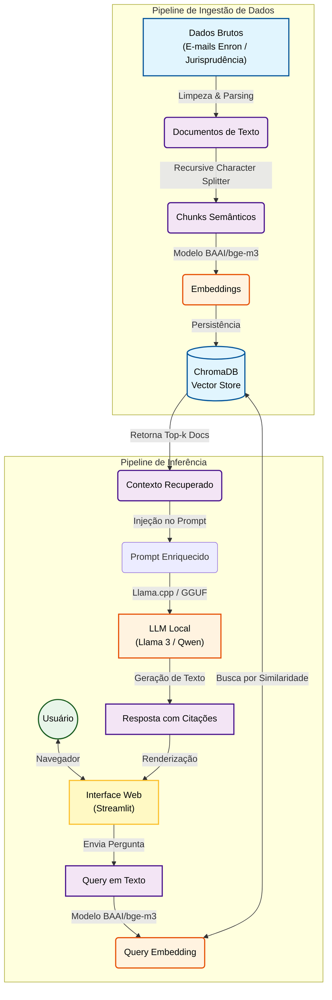

# Análise Semântica de Documentos Jurídicos com LLMs Locais: Uma Abordagem Focada em Privacidade

Este repositório contém a implementação de referência do Trabalho de Conclusão de Curso (TCC) desenvolvido no Departamento de Computação da Universidade Federal do Piauí (UFPI). O projeto consiste em um Assistente de Análise de Caso baseado em **RAG (Retrieval-Augmented Generation)**, projetado para operar inteiramente em ambiente local (on-premise), mitigando riscos de violação de sigilo profissional na advocacia.

**Autores:** Matheus Kaiky Brito Silva e Raimundo Santos Moura

## Visão Geral

A prática jurídica lida com volumes massivos de dados não estruturados. As soluções atuais baseadas em busca por palavras-chave falham em capturar nuances semânticas, enquanto as soluções de IA em nuvem apresentam riscos críticos de privacidade.

Este projeto propõe uma arquitetura que concilia a capacidade analítica de Grandes Modelos de Linguagem (LLMs) com a segurança de dados. O sistema permite a ingestão de documentos (e-mails e jurisprudência), a vetorização semântica e a geração de respostas fundamentadas com citações diretas às evidências, sem que nenhum dado trafegue para servidores externos.

### Principais Características

* **Privacidade por Design:** Execução 100% local, eliminando dependências de APIs proprietárias (como OpenAI).
* **Arquitetura RAG:** Combina recuperação de informação densa com geração de texto para reduzir alucinações.
* **Rastreabilidade:** As respostas geradas citam explicitamente os documentos de origem (ex: "Conforme E-MAIL 1...").
* **Suporte a Múltiplos Modelos:** Embora o modelo o Qwen 2.5 seja o modelo que será mais utilizado, há suporte para outros LLMs quantizados (GGUF) como Llama 3 ou Sabiá.
* **Diagnóstico de Recuperação:** Ferramentas para inspecionar o que o banco vetorial está retornando antes da geração.

## Arquitetura Técnica

O sistema foi desenvolvido em **Python 3.10+** e utiliza as seguintes tecnologias principais:

* **Orquestração:** [LangChain](https://github.com/langchain-ai/langchain) para gerenciamento do fluxo de RAG.
* **Banco Vetorial:** [ChromaDB](https://www.trychroma.com/) para armazenamento persistente de embeddings.
* **Motor de Inferência:** [Llama.cpp](https://github.com/ggerganov/llama.cpp) (via `llama-cpp-python`) para execução eficiente de LLMs em CPU/GPU.
* **Embeddings:** Modelo `BAAI/bge-m3` para representação vetorial multilíngue de alta performance.
* **Dados:**
    * *Evidências:* Dataset Enron (E-mails corporativos).
    * *Base Legal:* Jurisprudência Brasileira (Dataset Hugging Face `joelniklaus/brazilian_court_decisions`).



## Estrutura do Projeto

```text
tcc-ia-forense/
├── data/
│   ├── raw/             # Dados brutos (Dataset Enron e Jurisprudência)
│   └── vector_store/    # Banco de dados vetorial persistido (ChromaDB)
├── models/              # Pesos dos modelos LLM (formato .gguf)
├── src/
│   ├── config.py        # Configurações globais e seleção de modelos
│   ├── ingestion.py     # Scripts de processamento e vetorização de dados
│   ├── rag_engine.py    # Lógica do RAG, definição de prompts e chains
│   └── ...
├── download_resources.py # Utilitário para baixar modelos e datasets
├── main.py              # Ponto de entrada da aplicação (CLI)
├── playground.ipynb     # Notebook Jupyter para testes visuais e depuração
├── requirements.txt     # Dependências do projeto
└── README.md
````

## Instalação e Configuração

### Pré-requisitos

  * Python 3.10 ou superior
  * Recomendado: GPU com suporte a CUDA (NVIDIA) para inferência mais rápida ou CPU com instruções AVX2.
  * Git

### Passo a Passo

1.  **Clone o repositório:**

    ```bash
    git clone [https://github.com/matheuskaiky/tcc-ia-forense.git](https://github.com/matheuskaiky/tcc-ia-forense.git)
    cd tcc-ia-forense
    ```

2.  **Crie e ative um ambiente virtual:**

    ```bash
    python -m venv .venv
    # Windows
    .venv\Scripts\activate
    # Linux/Mac
    source .venv/bin/activate
    ```

3.  **Instale as dependências:**

    ```bash
    pip install -r requirements.txt
    pip install streamlit llama-cpp-python
    ```

4.  **Baixe os Recursos Necessários:**
    Execute o script auxiliar para baixar o Dataset Enron, a base de jurisprudência e o modelo LLM padrão (Llama 3 ou Qwen):

    ```bash
    python download_resources.py
    ```

## Utilização

O sistema opera via linha de comando (CLI) através do arquivo `main.py`.

### 1\. Ingestão de Dados

Antes de realizar consultas, é necessário processar os documentos e criar o índice vetorial.

```bash
python main.py --ingest
```

*Este processo pode levar alguns minutos dependendo do hardware.*

### 2\. Modo Interativo (Chat)

Inicia uma sessão de chat contínuo com o assistente forense.

```bash
python main.py --interactive
```

### 3\. Consulta Única

Para realizar uma pergunta rápida diretamente via terminal:

```bash
python main.py --query "Existe evidência de manipulação de mercado nos e-mails?"
```

### 4\. Diagnóstico

Para verificar se o sistema de recuperação (Retrieval) está encontrando os documentos corretos sem acionar o LLM (útil para debug):

```bash
python main.py --diagnose "preços de gás"
```

### 5\. Executando o Assistente (Interface Web)

Para iniciar o Assistente Jurídico Forense no seu navegador:
Bash

```bash
streamlit run app.py
```

## Configuração Avançada

O arquivo `src/config.py` controla os parâmetros do sistema. Você pode alterar o modelo utilizado modificando a variável de ambiente ou editando o arquivo:

Modelos suportados (definidos em `AVAILABLE_MODELS`):

  * `llama3` (Meta-Llama-3-8B-Instruct)
  * `qwen2.5-14b` (Qwen2.5-14B-Instruct - *Padrão*)
  * `sabia3` (Sabiá-3, otimizado para português)

Para alterar o modelo via variável de ambiente (Linux/Mac):

```bash
export MODEL_CHOICE=llama3
python main.py --interactive
```

## Referências

  * **Dataset Enron:** Klimt, B. and Yang, Y. (2004). The enron corpus: A new dataset for email classification research.
  * **RAG:** Lewis, P. et al. (2020). Retrieval-augmented generation for knowledge-intensive nlp tasks.
  * **LangChain:** Chase, H. (2022). LangChain Framework.

-----

*Este projeto é parte dos requisitos para obtenção do grau de Bacharel em Ciência da Computação pela UFPI.*
